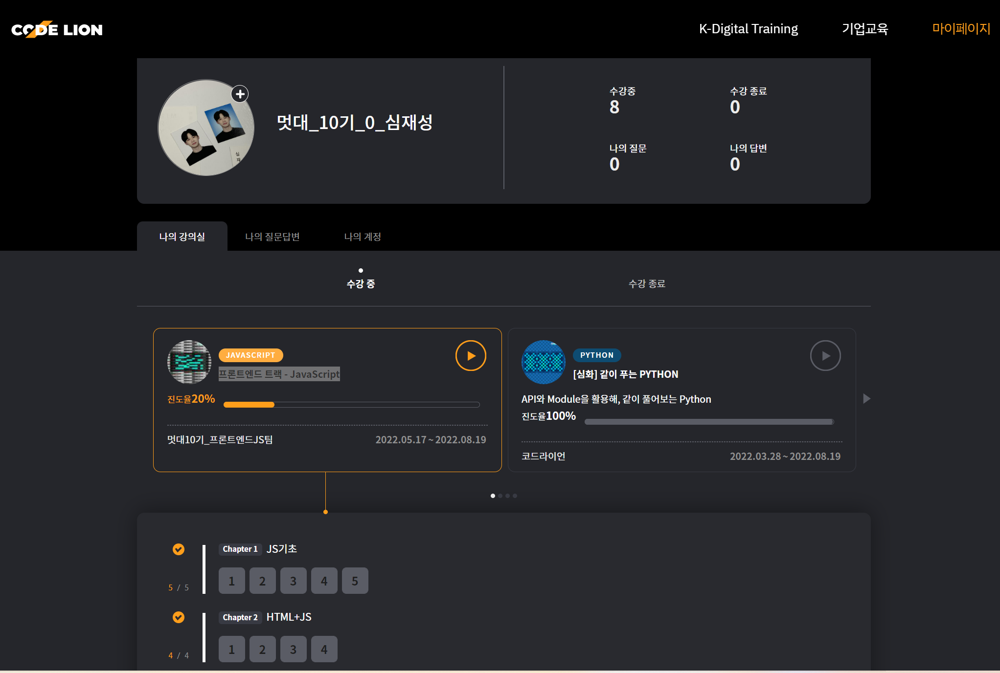

## 1. 일치
- 자바스크립트에서의 일치확인 법은 === 
- 일치하지 않는걸 확인할떄는 !==
### 다른 언어와 달리 '='를 3개 사용한다
---
## 2. 템플릿 리터럴
- Backtick(`) 안의 템플릿에 변수를 주입시켜서 문자열을 만드는 방식.
- ${변수}, 문자열이 길고 합성되는 변수들이 많다면, 템플릿 리터럴의 가독성이 높아짐
- <pre>${function()} # 함수를 넣는것도 가능 </pre> 
- <pre>조건주기 age: ${age >= 25 ? 'Over 25' : 'Under 25'} #3항 연산자도 가능</pre>
- <pre>중첩 템플릿 리터럴, age: ${age >= AVERAGE ? `Over ${AVERAGE}` : `Under ${AVERAGE}`}</pre>
---
## 3. JS로 HTML접근
- ### document.getElementsById('id값');
- ### document.getElementsByTagName('태그이름');
- ### document.getElementsByClassName('class 값');
- ### document.querySelector('css선택자'); 최상단 하나만 선택
- ### document.querySelectorAll('css선택자'); 조건에 만족하는거 모두 선택, 인덱싱으로 요소에 접근
## !!querySelector가 굉장히 유용하고 편리할것 같다.
---
### innerHTML += 로 코드를 추가할수있다
---
## 4. 자바스크립트로 직접 HTML내에 클래스를 추가,제거하는 방법
- document.querySelector('').classList.add('');
- document.querySelector('').classList.remove('');

## 5. 토글 - 있으면 추가 없으면 제거
- document.querySelector('').classList.toggle('');
- 스위치 온/오프 같은 기능
---
## 6. 중요! 이벤트 !
- addEventListener(이벤트타입, 이벤트핸들러(함수), 캡쳐사용여부);
- 이벤트는 정말 다양해서 사용하는법만 익히고 구글링으로 접근할 생각을 해야함

### 클릭이벤트를 발생시켜 원하는 요소를 창에 띄우는 js코드

<pre>
<code>
document.querySelectorAll(".list")[0].addEventListener("click", function(e){
    button(e.target.dataset.id);
});
 ## dataset 관련 함수는 알아두면 좋겠다

function button(k){
    document.querySelectorAll('.tab-btn')[k].addEventListener("click",function(){
        for(let i = 0; i < document.querySelectorAll('.tab-btn').length; i++){
            document.querySelectorAll('.tab-btn')[i].classList.remove("here");
            document.querySelectorAll('.tab-btn')[i].classList.remove("show");   
        }
    
    document.querySelectorAll('.tab-btn')[k].classList.add("here");
    document.querySelectorAll('.tab-btn')[k].classList.remove("show");
    });
};
</code>
</pre>
- document.querySelectorAll과 document.querySelector의 차이를 알면서 사용해야겠다.
---
### +
- script링크 코드를 중간에 삽입한채로 강의와 똑같이 써도코드가 실행되지않아 화가 꽤났다,,,,,,,script링크 코드는 마지막이나 헤드부분에 넣어주자...
- 코드를 짜기전에 한글로 먼저정리하고 코드를 작성하면 편리하다.

---
## 7. Timer
- setTimeout - 타이머가 만료된 후에 딱 한번 호출
- setInterval - 코드를 일정한 시간간격을 두고 반복