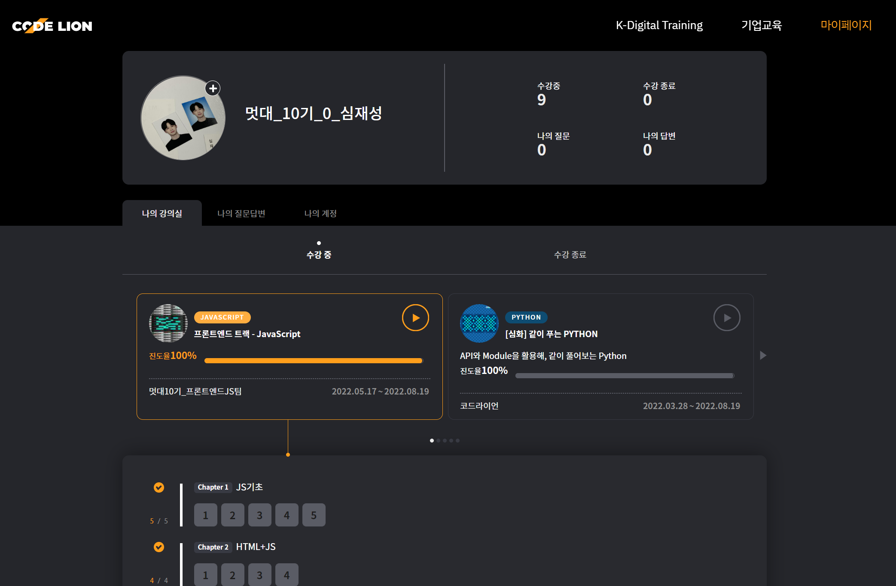

# 1
### 1-1. 자바스크립트는 자기 입맛에 맞게 데이터타입을 변환하기에 우리는 정확한 타입을 입력해줘야한다

### 1-2. truly falsely, '' 은 not

### 1-3. 화살표함수 () => {}
<pre>
<code>
const add = (a,b) => { return a+b };
return이 {와 붙어있다면 생략가능

#위와같음 !!
const add = (a,b) => a+b;
</code>
</pre>

### 1-4.JS에서 함수는 일급객체이다, ex) addEventListener

### 1-5 비동기 ? - 동기적 언어인 파이썬과 달리 자바스크립트는 비동기적 언어이다.

<pre>
<code>
fetch("").then(res=> res.json()).then(console.log);
console.log('test');
</code>
</pre>

- console.log는 비동기 작업이아님.
- 콘솔창에는 test가 먼저 출력되고 그 후 res가 출력이된다?

  - 비동기 작업을 실행시킨채 다음 작업으로 넘어가서 test가 먼저 출력되는것같다????

### 1-6.프로미스 ? Promise

- 프로미스의 상태

    1. pending : 프로미스 처리중
    2. fulfilled : 프로미스 이행(정상처리완료)
    3. Rejected : 프로미스 실패(처리완료. 하지만 비정상적으로)

fetch("").then(res=> res.json()).then(console.log)

then에는 함수형태가 들어가야함 console.log가 함수이기에 이는 앞에서 반환받은 res를 출력하게됨

### 1-7. 논리연산자 &&
<pre>
<code>
if( a !== b){
	console.log("hi");}
는
a !== b && console.log("hi"); 와 같다.
# a !== b 가 성립이되어아 뒤 코드가 실행되는 과정이다.
</code>
</pre>

### 1-8. 논리연산자 ||
<pre>
<code>
const input = prompt();
console.log(input || "입력값이 없습니다.);

input값이 있으면 input만 출력 , 아무값도 없으면 입력값이 없음을 출력
</code>
</pre>

### 1-9. 비구조화 할당
Destructring
<pre>
<code>
const a = obj.a;
const b = obj.b;
이둘은 같은 코드이다
const {a,b} = obj;
</code>
</pre>

### 1-10. 스프레드 spread
<pre>
<code>
const me = {};
const Ime = {...me}; me의 요소가 안으로 들어감

객체는 객체에게만 배열은 배열에게만 할수있음
</code>
</pre>

### 1-10. 레스트(나머지) rest

<pre>
<code>
const { 키값, ...another} = me;
console.log(another);
me의 키값만 제외하고 다 가져와 객체를만듬

const num = [0,1,2,3,4,5,6];
const [zero, ...rest] = numbers;
console.log(rest);
0을제외한 배열이 출력됨
</code>
</pre>

# 2
## 반응형 웹사이트 제작을 도와주는 
 - ## Bootstarp

## SPA (single page application)
 - ## 싱글 페이지 애플리케이션은 현재페이지에서 동적으로 다시 작성함으로써 사용자와 소통하는 웹 앱이나 사이트

# 3 
## Data 주고받는 필요성 ?

### 블로그, 메신저와 같은 기능을 사용하기위해서는 필요하다!

 - 프론트엔드 서버와 백엔드 서버의 교류
    - by request, response

### Data 주고받기!

### 1. 어떤 방식으로 정보를 주고받을까 ?
 - 어떤 원칙으로 가지고 프로그램을 연결 ? = 어떤 API를 사용할까 ?

REST API
{REST API}

1. URL는 정보의 자원을 표현해야한다
2. 자원에 대한 행위는 HTTP메소드로 표현한다 (GET,POST,PUT,DELETE)

### 2. 정보의 형태는 어떻게 할까?
 - JSON - 단순히 data format 프로그래밍 언어에 독립적이다.

---
## JS로 쉽게 REST API 사용하기!
1. Fetch
2. Axios
## Fetch를 사용해보자~

  

# MOIVE실습 만들기

## step 1. TMDB에서 내 APIKEY 받아오기
<pre>
<code>
const APIKEY = '*********';
</code>
</pre>

### 하고싶은 행위에 대하여 option을 설정해줄수도 있음
<pre>
<code>
const options = {
    method: 'GET',
    headers :{
        'Content'
    }
}
</code>
</pre>
## step 2.사용하고싶은 부분의 URL을 가져오기
<pre>
<code>
const now_playingURL = "https://api.themoviedb.org/3/movie/now_playing?api_key="+APIKEY+"&language=en-US&page=1"

#이미지를 사용하기 위한 선 URL
const IMGURL = 'https://image.tmdb.org/t/p/w500';
</code>
</pre>

## step 3. 위 해당 URL에서 가져온 객체에 대해 HTML상으로 보여주기
<pre>
<code>
const now_playing = document.getElementById("now-playing");
fetch(now_playingURL)
    .then(response => response.json()) #json형태로 변환
    .then(response => {
        response.results.forEach((element) =>{  #위 모든 요소에 대하여
            console.log(element.backdrop_path); #배경 value출력
            console.log(element.title); # 제목 value출력
            console.log(element.vote_average); #별점 value출력

            let moive = document.createElement("li"); #li태그 생성
            let moive_div = document.createElement("div"); # div태그 생성
            let moive_img = document.createElement("img"); # img태그 생성
            moive_img.setAttribute("src",IMGURL+element.backdrop_path); 
            #img태그 src 생성 위 배경의 키값인 backdrop_path를 사용하면됨

            let title = document.createElement("h4");  # h4태그 생성
            title.innerText = element.title;  # h4에 제목을 innerText
            let rate = document.createElement("span");  # span태그 생성
            rate.innerText = "* "+element.vote_average; # span에 별점 추가

            moive_div.appendChild(moive_img); 
            moive_div.appendChild(title);
            moive_div.appendChild(rate); #div에 3 태그를 자식으로추가 후
            moive.appendChild(moive_div); # li 태그안에 넣어준 후

            now_playing.appendChild(moive); #최종적으로 추가 해주기
        })
    });
</code>
</pre>
