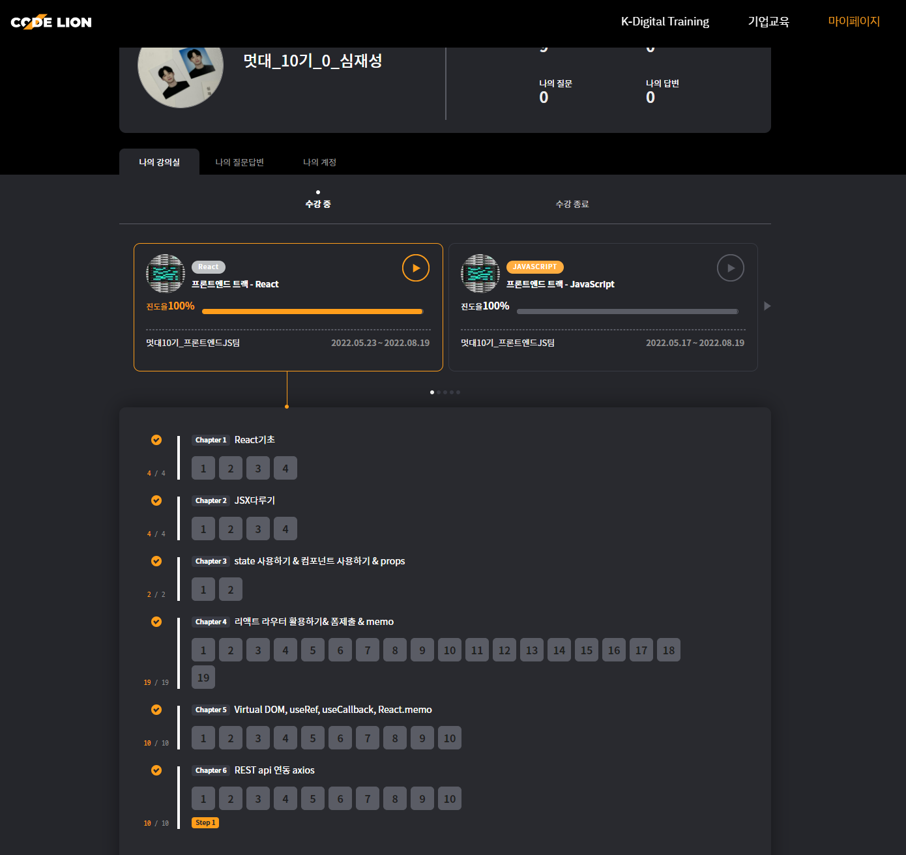

## "React는 유저 인터페이스(UI)를 만들기 위한 자바스크립트 라이브러리다"

## # JSX 문법 파헤치기
### 1. 하나의 요소로 감싼다.
 - 이때 불필요한 div태그 사용을 줄이기 위해 Fragment태그를 사용한다. 
 
 이는 렌더링 되었을때 생략된다고 생각하면 되겠다. 이와 같은게 <> </>이다.

### 2. 자바스크립트 표현식의 사용
- {}, brackets로 감싸 변수들을 쉽게 웹상에 보여줄수있다.

### 3. 조건부 렌더링
 - return문 밖에서 사용하는 방법
 - && ,|| 사용하는 방법
 - case문 사용하기
 - ! 삼항연산자 사용하기
      -> 가장 유용하다,무한 중첩가능하다. num == 1 ? A : B

## #2 유용한 개발 툴
- React Developer Tools, 
    - componet Tab -> element 쉽게 확인 가능
    - profiler Tab -> 컴포넌트 랜더링 시간 확인가능

- VScode 툴
  - prettier
  - Reactjs code snippets -> rfc만 치면 함수형태 완성
  - Auto Import

## # JSX와 BABEL
- JSX = JS + XML
- BABEL => JSX를 JS로 변환해주는 좋은 친구

## # styled components 라이브러리
 - 이를 사용하면 JSX안에 CSS사용가능하다, 별도의 css파일이 필요가 없다

## #그외 다른
- component -> 앱을 이루는 최소한의 단위, class형태보다는 함수 형태를 더 선호
- props -> properties, 컴포넌트 속성 설정시에 사용하는 요소. defaulitprops 설정가능하다.
- state -> 컴포넌트 내부에서 바뀔 수 있는 값
- useState -> 배열의 비구조화 할당
- export -> 모듈(분리한 컴포넌트)를 내보내주는
- map()함수 -> 반복되는 Component에 적용하기 좋은 함수, key값을 설정하라는 warning 메시지가 뜨는데, key설정시 빠른 변화를 감지 할 수 있다.

## #MPA ? SPA?
 - MAP -> Multiple Page Application
    - 상태유지 어려움, 불필요한 조정이 많다는 단점

- SPA -> Single Page Application 리액트가 채택하는 방식, by 라우팅

## #Route
- Route path =""></Route 로 경로 설정
- Link to=""></Link 로 페이지 이동
- Outlet/> 을 통해 중첩경로 설정, 상위의 닫는 Route태그를 하위 밑에다 닫는다, Outlet/>지정한 위치에 하위 Route태그의 내용이 UI로 보여진다

## #페이지 주소 정의 

- URL 파라미터 -> 특정 아이디, 이름을 사용하여 조회할떄 사용
ex) :/movies/1

- 쿼리스트링 -> 키워드 검색, 페이지네이션, 옵션전달
ex)/movies/1?detail=true

## #useParams
- URL파라미터를 사용하여페이지의 주소를 정의하는데 있어서 원하는 것의 고유값을 불러 UI로 띄우는데 용의 할거같다는 생각이 들었다

## # useLocation
- 객체로 반환되는 파라미터의 정보들에서 원하는 key에 접근하기 위해 사용하는 함수이다.

## #404페이지를 만들기
- 마지막 Route에 path="*"로 주면 404페이지를 만들 수 있다

## #Link 컴포넌트 대신 navigate컴포넌트를 사용하는 방법도있다.

## #NavLink ? 
- Link에서 사용하는 경로가 현재 경로와 일치하면 css를 적용할수있다

## #useEffect ?
- 리액트 컴포넌트가 렌더링 될 때마다 특정작업을 실행할 수 있도록 하는 HOOK
- useEffect(function, deps)

- 랜더링될떄 한번만 실행시키기 -> 빈배열 넣기.useEffect(function, [])
- props나 state가 바뀔 때 실행 -> 특정 값 넣기,useEffect(function, [특정값])

## #useMemo()?
- 성능 최적화를 위해 연산된 값을 재사용하게 해주는 Hook

- useMemo(function, deps)
- function: 어떤 연산을 할 지 정의하는 함수
- deps: 검사하고자 하는 값 또는 배열, 배열형태
- 특정 값이 바뀌면 함수를 호출하여 연산, 그러지않으면 재사용한다

## #React Virtual DOM?
- state change -> compute diff -> re-render
- Real DOM의 추상화 버전, 비슷한 역할을하지만 / 
- 다른 사용방법을 사용한다.
  - 자바스크립트의 객체 형태로 메모리에 저장
  - 렌더링 되지않고 메모리에서 우선 동작하고 이후 한번에 달라진 부분 적용

## #useRef ?

- React는 virtual DOM으로 다른 조작 방식이 필요하다.
- Real DOom 생성시 id, class name 정확히 가져온다는 보장 x
- virtual DOM에서 조작하고 결과물만 real DOM으로 !! 해주는 것이 useRef다.
- useRef를 통해 별도의 id classname설정이 필요없다(엔터를 치면 다음 입력창으로 넘어가는 것도 다 이벤트 설정해주는거였다니...)

## #useCallback?

최적화를 해보자 !
컴포넌트 재렌더링 될때마다 함수의 재생성에 관한 비효율성을 줄이기 위해 
useCallback을 통해 함수를 memorize한다 !

## #React.memo
상위 컴포넌트가 재렌더링되면 하위 컴포넌트도 자동으로 재렌더링되는데
React.memo를 사용하면 컴포넌트를 memorize해놨다가 필요한 상황에서만 재렌더링한다!

## #axios ?
- 서버와 통신하게 도와주는 라이브러리

- axios를 통해 가져온 데이터들과 앞서 배운 여러 함수들을 통해 pagination를 비롯해 여러 페이지의
데이터를 패칭해서 UI로 보여준는 방법과 댓글 작성, 리다이렉트등 여러 신기한걸 배웠다.
다음 개발할일이있을때 참고하러오면 좋을 것같다.

